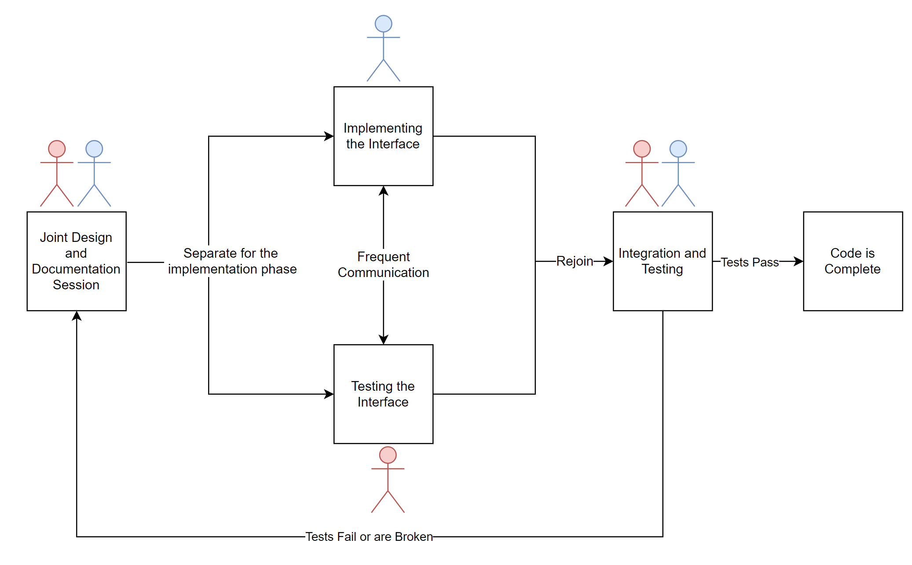

# Virtual Collaboration and Pair Programming

Pair programming is the de facto work method that most large engineering organizations use for “hands on keyboard” coding. Two programmers, working synchronously, looking at the same screen and attempting to code and design together, which often results in better and clearer code than either could produce individually.

Pair programming works well under the correct circumstances, but it loses some of its charm when executed in a completely virtual setting. The virtual setup still involves two programmers looking at the same screen and talking out their designs, but there are often logistical issues to deal with, including lag, microphone set up issues, workspace and personal considerations, and many other small, individually trivial problems that worsen the experience.

Virtual work patterns need to deviate from the in-person patterns we are accustomed to. Pair programming at its core is based on the following principles:

1. Generating clarity through communication
2. Producing higher quality through collaboration
3. Creating ownership through equal contribution

Pair programming is simply one way to achieve these results. We present Red Team Testing (RTT) as a different programming method that takes the same principles but uses some of the advantages that virtual work methods provide.

## Red Team Testing

Red Team Testing borrows its name from the “Red Team” and “Blue Team” paradigm of penetration testing, and is a collaborative, parallel way of working virtually. In Red Team Testing, two programmers jointly decide on the interface, architecture, and design of the program, and then separate for the implementation phase. One programmer writes tests using the public interface, attempting to perform edge case testing, input validation, and otherwise stress testing the interface. The second programmer is simultaneously writing the implementation which will eventually be tested.

Red Team Testing has the same philosophy as any other Test-Driven Development lifecycle: All implementation is divorced from the interface, and the interface can be tested with no knowledge of the implementation.

## Steps

1. Design Phase: Both programmers will design the interface together. This includes:
    * Method signatures and names
    * Writing documentation or docstrings for what the methods are intended to do.
    * Architecture decisions that would influence testing (Factory patterns, etc.)

2. Implementation Phase: The programmers will separate and parallelize work, while continuing to communicate.
    * Programmer A will design the implementation of the methods, adhering to the previously decided design.
    * Programmer B will concurrently write tests for the same method signatures, without knowing details of the implementation.

3. Integration & Testing Phase: Both programmers will commit their code and run the tests.
    * Utopian Scenario: All tests run and pass correctly.
    * Realistic Scenario: The tests have either broken or failed due to flaws in testing. This leads to further clarification of the design and a discussion of why the tests failed.

4. The programmers will repeat the three phases until the code is functional and tested.

## When to follow the RTT strategy

RTT works well under specific circumstances. If collaboration needs to happen virtually, and all communication is virtual, RTT reduces the need for constant communication while maintaining the benefits of a joint design session. This considers the human element: Virtual communication is more exhausting than in person communication.

RTT also works well when there is complete consensus, or no consensus at all, on what purpose the code serves. Since creating the design jointly and agreeing to implement and test against it are part of the RTT method, RTT forcibly creates clarity through iteration and communication.

## Benefits

RTT has many of the same benefits as Pair Programming and Test-Driven development but tries to update them for a virtual setting.

* Code implementation and testing can be done in parallel, over long distances or across time zones, which reduces the overall time taken to finish writing the code.

* RTT maintains the pair programming paradigm, while reducing the need for video communication or constant communication between engineers.

* RTT allows detailed focus on design and engineering alignment before implementing any code, leading to cleaner and simpler interfaces.

* RTT forces testing to be prioritized alongside implementation, instead of having testing follow or be influenced by the implementation of the code.

* Documentation is inherently a part of RTT, since both the implementer and the tester need correct, up to date documentation in the implementation phase.

## What you need for RTT to work well

* Demand for constant communication and good teamwork may pose a challenge; daily updates amongst team members are essential to maintain alignment on varying code requirements.

* Clarity of the code design and testing strategy must be established beforehand and documented as reference. Lack of an established design will cause misalignment between the two major pieces of work and a need for time-consuming refactoring.

* RTT does not work well if only one engineer has knowledge of the overall design. Team communication is critical to ensuring that every engineer involved in RTT is on the same page.